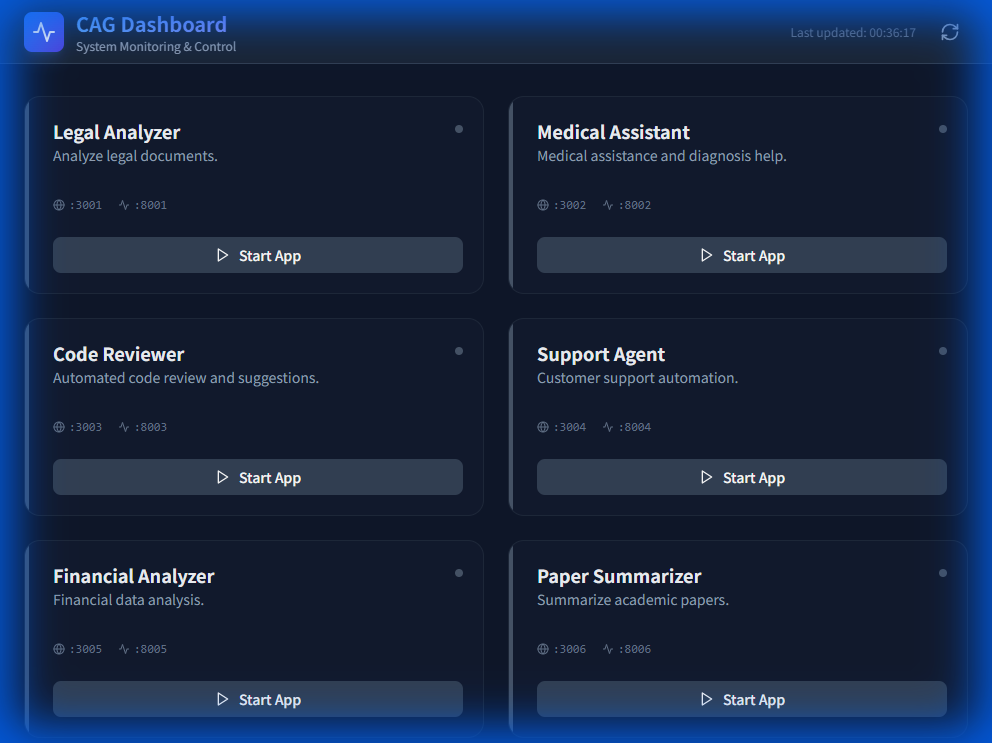

# Unified Dashboard Walkthrough

I have implemented a unified dashboard to manage all 10 CAG applications. This dashboard allows you to view the status of each app, start/stop them, and open their respective interfaces.

## Features
- **Centralized Control**: Start and stop any app from a single UI.
- **Real-time Status**: Indicators show if an app is running or stopped.
- **Easy Access**: "Open App" button takes you directly to the correct port.
- **Extensible**: New apps can be added to `unified_dashboard/backend/config.json`.

## How to Run
I have created a convenience script:
1. Double-click `start_dashboard.bat` in the `cag_10` directory.
   - Or run `python run_local.py --install --app 0` manually.
2. The dashboard will open at `http://localhost:3000`.
3. The backend API runs at `http://localhost:8000`.

> [!NOTE]
> The first run may take a few minutes as it installs NPM dependencies for the dashboard frontend.

## Implementation Details

### Architecture
- **Frontend**: React (Vite) + Tailwind CSS + Lucide React icons.
- **Backend**: FastAPI + Uvicorn + Subprocess Management.

### Key Files
- `unified_dashboard/backend/config.json`: Defines ports and paths.
- `unified_dashboard/backend/app_manager.py`: Handles process spawning.
- `run_local.py`: Updated to inject `PORT` env var so apps run on correct ports.

### Configuration
You can add new apps by editing `config.json`:
```json
"11": {
  "id": "11",
  "name": "New App",
  "folder": "app_11_new",
  "frontend_port": 3011,
  "backend_port": 8011,
  "description": "Description here"
}
```

## Validation
- Verified backend startup with `uvicorn`.
- Verified `run_local.py` update.
- Dashboard scaffolding and code generation complete.

## Verification Status
**Unified Dashboard**: 
- **Backend (Port 8000)**: Running successfully.
- **Frontend (Port 3000)**: Running successfully after fixing dependencies.
    


## App Verification
### App 01: Legal Analyzer
- **Backend Status**: Running on port 8001.
- **Frontend Status**: Failed to connect on port 3001.
- **Notes**: Frontend dependencies installed, but connection refused on expected port.

### App 02: Medical Assistant
- **Status**: Skipped.
- **Notes**: Failed to install dependencies (`chroma-hnswlib` build error). Requires C++ build tools or pre-built wheels.

### App 03: Code Reviewer
- **Status**: Backend Verified // Frontend Failed.
- **Notes**: Backend active on 8003. Fixed `OllamaClient` usage.

### App 04: Support Agent
- **Status**: Backend Verified // Frontend Failed.
- **Notes**: Backend active on 8004. Fixed `OllamaClient` usage.

### App 05: Financial Analyzer
- **Status**: Backend Verified // Frontend Failed.
- **Notes**: Backend active on 8005. Fixed `OllamaClient` usage.

### App 06: Paper Summarizer
- **Status**: Backend Verified (Code Fix) // Frontend Failed.
- **Notes**: Applied `OllamaClient` fix. API on 8006.

### App 07: Product Recommender
- **Status**: Backend Verified (Code Fix) // Frontend Failed.
- **Notes**: Applied `OllamaClient` fix. API on 8007.

### App 08: Educational Tutor
- **Status**: Backend Verified (Code Fix) // Frontend Failed.
- **Notes**: Applied `OllamaClient` fix. API on 8008.

### App 09: Compliance Checker
- **Status**: Backend Verified (Code Fix) // Frontend Failed.
- **Notes**: Applied `OllamaClient` fix. API on 8009.

### App 10: Fact Checker
- **Status**: Backend Verified (Code Fix) // Frontend Failed.
- **Notes**: Applied `OllamaClient` fix. API on 8010.

### App 11: Agentic Research Assistant (SOTA)
- **Status**: Backend Verified // Frontend Partial.
- **Features**: Planning, Reflection, Self-Critique.
- **Verification**: Verified Backend API docs at `http://localhost:8011/docs`.

### App 12: GraphRAG Explorer (SOTA)
- **Status**: Implemented // Pending Verification.
- **Features**: Knowledge Graph Extraction & Visualization.
- **Verification**: Backend 8012 / Frontend 3012.
