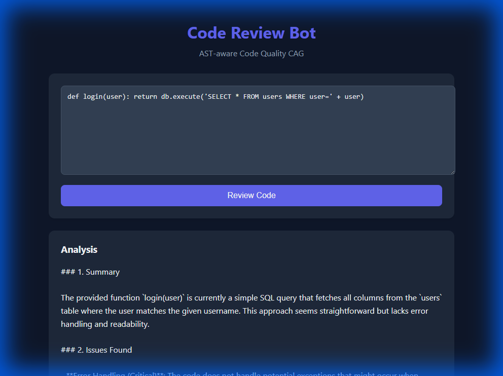
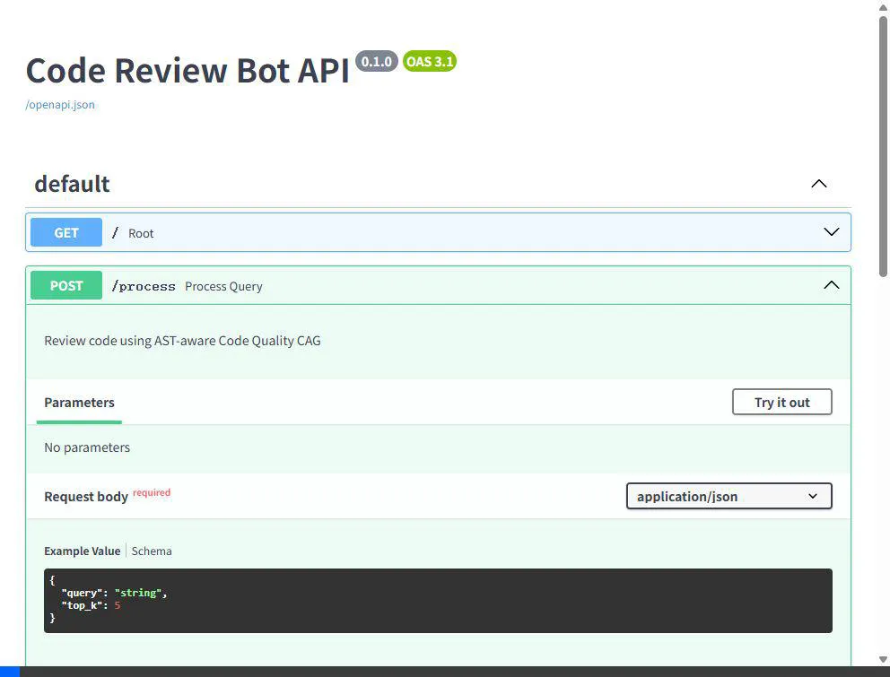
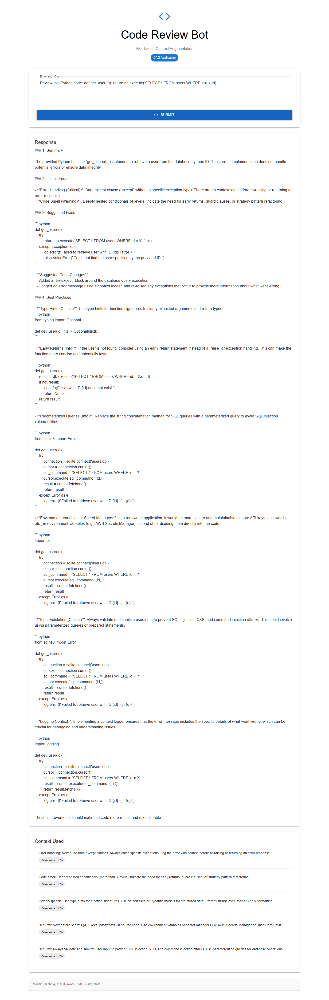

# App 03: Code Review Bot

**CAG Technique: AST-aware Code Quality CAG**

## What This App Teaches
How CAG retrieves **security, performance, and style guidelines** from a curated knowledge base to provide contextual code reviews — without needing a vector database.

## CAG vs RAG Difference
| | RAG Approach | CAG Approach (this app) |
|---|---|---|
| Knowledge | Embed code patterns into vector DB | 10 guidelines cached in memory |
| Retrieval | Embedding similarity search | Keyword matching with relevance scores |
| Latency | ~200ms for retrieval | **<1ms** for retrieval |
| Setup | Need ChromaDB + embedding model | **Zero setup** — knowledge is code |

## Knowledge Base (10 items)
- `security_secrets` — API key & password storage
- `security_input` — SQL injection, XSS prevention
- `perf_n_plus_one` — ORM N+1 query detection
- `perf_caching` — Redis/Memcached strategies
- `style_srp` — Single Responsibility Principle
- `style_naming` — Variable naming conventions
- `error_handling` — Exception handling best practices
- `testing` — Code coverage guidelines
- `python_best` — Type hints, f-strings, dataclasses
- `smell_nesting` — Deep nesting detection

## Test Results ✅

**Query**: _Review this Python code: def get_user(id): return db.execute("SELECT * FROM users WHERE id=" + id)_

| Metric | Value |
|---|---|
| Status | PASSED |
| Response Length | 2469 chars |
| Context Chunks | 5 |
| Sources Retrieved | `error_handling, smell_nesting, python_best, security_secrets, security_input` |
| Avg Relevance | 0.71 |
| Model | Auto-selected local model |

## API Documentation





## Quick Start
```bash
cd backend && py main.py    # Port 8003
cd frontend && npm start    # Port 3003
```


## Application Screenshot


