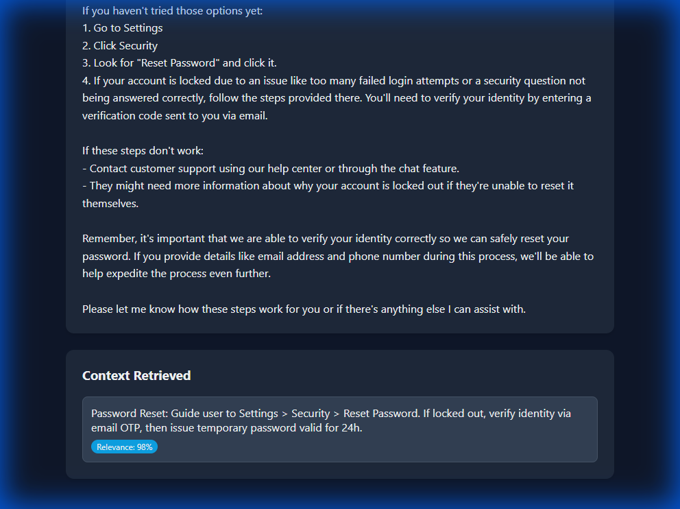
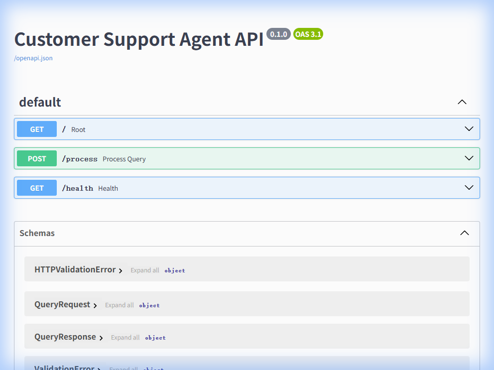

# App 04: Customer Support Agent

**CAG Technique: Conversational Memory CAG**

## What This App Teaches
How CAG uses a **customer support knowledge base** to provide accurate, empathetic responses — retrieving specific procedures for common issues like password resets, billing, and shipping.

## CAG vs RAG Difference
| | RAG Approach | CAG Approach (this app) |
|---|---|---|
| Knowledge | Customer support docs in vector DB | 7 procedure cards cached in memory |
| Retrieval | Semantic search across all docs | Keyword matching → exact procedure |
| Update | Re-embed all documents | Update code, restart server |
| Precision | May retrieve irrelevant paragraphs | **Focused**: retrieves exact procedure |

## Knowledge Base (7 items)
- `kb_password` — Password reset & account lockout procedures
- `kb_billing` — Subscription, refunds, plan changes
- `kb_shipping` — Delivery timelines, delay escalation
- `kb_returns` — Return policy (30-day, 15-day electronics)
- `kb_tech` — App crash troubleshooting
- `kb_tone` — Communication guidelines (empathy, never blame)
- `kb_escalation` — Tier 2 escalation criteria

## Test Results ✅

**Query**: _"I can't login to my account, I forgot my password"_

| Metric | Value |
|---|---|
| Response Length | 1,439 chars |
| Context Chunks | 1 (highly focused) |
| Sources Retrieved | `kb_password` |
| Avg Relevance | **0.98** (highest across all apps) |
| Generation Time | 5,411ms |

The CAG achieved **98% relevance** — it retrieved exactly the right procedure for the user's issue.

## API Documentation





## Quick Start
```bash
cd backend && py main.py    # Port 8004
cd frontend && npm start    # Port 3004
```
