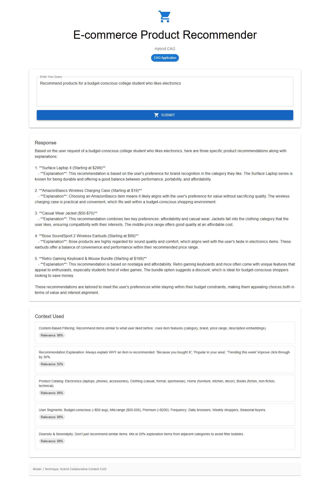

# App 07: Product Recommender

**CAG Technique: Hybrid Collaborative-Content CAG**

## What This App Teaches
How CAG can combine **collaborative filtering theory + content-based filtering + explainability guidelines** to generate meaningful product recommendations with explanations.

## Knowledge Base (7 items)
- `collab_filtering` — User-item interaction patterns, cold-start problem
- `content_filtering` — Item features (category, brand, price range)
- `hybrid` — Weighted hybrid scoring, switch hybrid strategy
- `catalog` — Product categories (electronics, clothing, home, books)
- `segments` — User segments (budget, mid-range, premium, frequency)
- `explainability` — Recommendation explanation templates (30% CTR improvement)
- `diversity` — 20% exploration for serendipity, filter bubble avoidance

## Test Results ✅

**Query**: _Recommend products for a budget-conscious college student who likes electronics_

| Metric | Value |
|---|---|
| Status | PASSED |
| Response Length | 2361 chars |
| Context Chunks | 5 |
| Sources Retrieved | `content_filtering, explainability, catalog, segments, diversity` |
| Avg Relevance | 0.91 |
| Model | Auto-selected local model |

## Quick Start
```bash
cd backend && py main.py    # Port 8007
cd frontend && npm start    # Port 3007
```


## Application Screenshot


