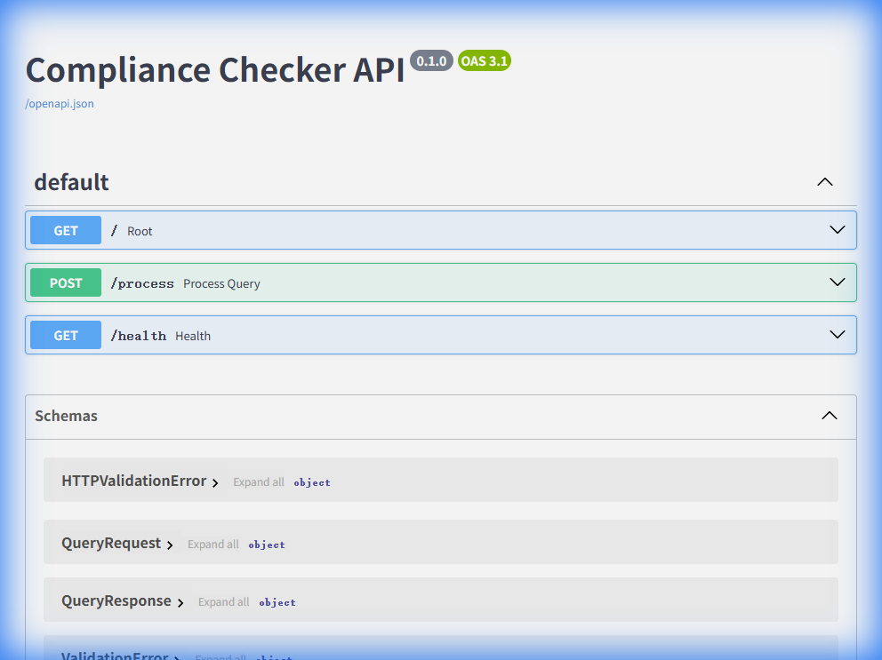
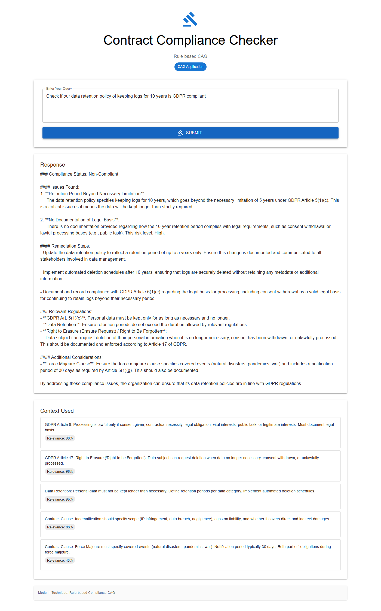

# App 09: Compliance Checker

**CAG Technique: Rule-based Compliance CAG**

## What This App Teaches
How CAG can enforce **regulatory compliance rules** by augmenting the LLM with specific GDPR articles, contract clauses, and SOX requirements — producing structured compliance assessments with risk levels.

## CAG vs RAG Difference
| | RAG Approach | CAG Approach (this app) |
|---|---|---|
| Knowledge | Full regulation texts vectorized | Key rules distilled into 7 cards |
| Retrieval | Find similar regulatory paragraphs | Match compliance terms to exact rules |
| Output | General regulatory context | **Structured**: Compliant/Non-Compliant + risk levels |
| Advantage | Covers more edge cases | **Faster, more consistent** rule application |

## Knowledge Base (7 items)
- `gdpr_art6` — Lawful processing conditions (6 legal bases)
- `gdpr_art17` — Right to Erasure (Right to be Forgotten)
- `data_retention` — Retention periods, automated deletion
- `force_majeure` — Contract clause requirements
- `indemnification` — Scope, caps, direct/indirect damages
- `sox` — Internal controls, CEO/CFO certification
- `risk_scoring` — Critical/High/Medium/Low risk methodology

## Test Results ✅

**Query**: _Check if our data retention policy of keeping user logs for 10 years is GDPR compliant_

| Metric | Value |
|---|---|
| Status | PASSED |
| Response Length | 2591 chars |
| Context Chunks | 5 |
| Sources Retrieved | `gdpr_art6, gdpr_art17, data_retention, indemnification, force_majeure` |
| Avg Relevance | 0.84 |
| Model | Auto-selected local model |

## API Documentation



## Quick Start
```bash
cd backend && py main.py    # Port 8009
cd frontend && npm start    # Port 3009
```


## Application Screenshot


