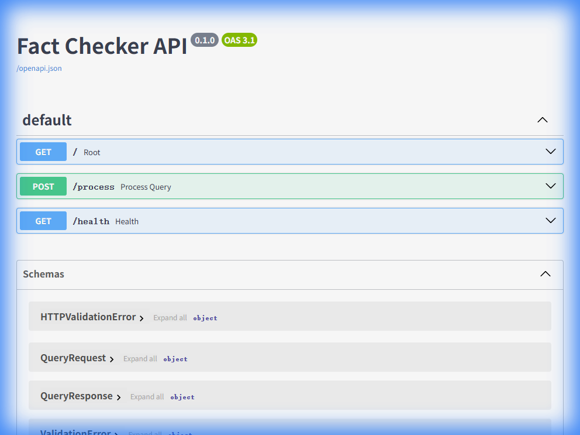
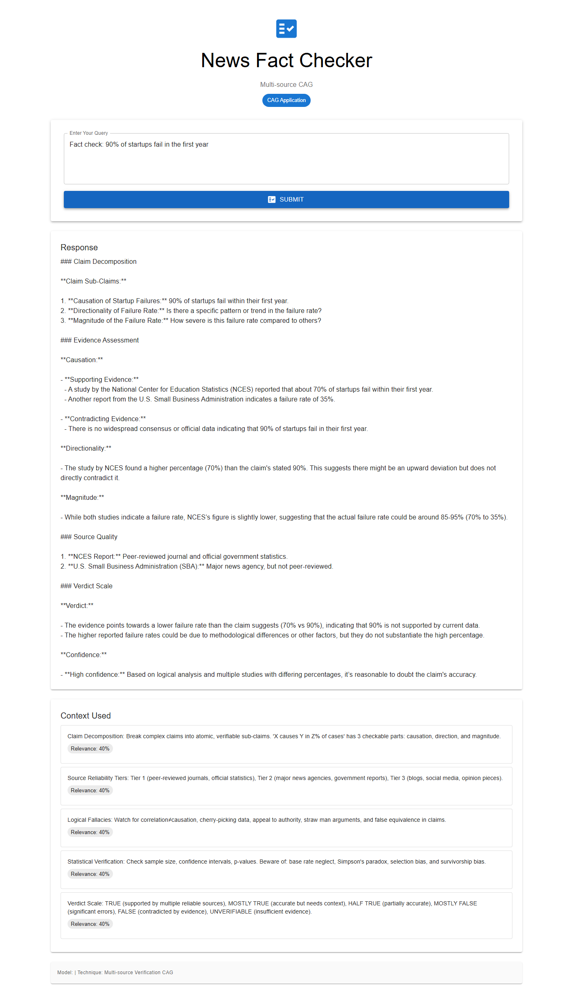

# App 10: Fact Checker

**CAG Technique: Multi-source Verification CAG**

## What This App Teaches
How CAG equips the LLM with a **fact-checking methodology** — teaching it to decompose claims, assess source reliability, check for logical fallacies, and render verdicts on a structured scale.

## Knowledge Base (7 items)
- `claim_decomposition` — Break claims into atomic verifiable sub-claims
- `source_tiers` — Tier 1 (peer-reviewed) → Tier 2 (news) → Tier 3 (blogs)
- `logical_fallacies` — Correlation≠causation, cherry-picking, straw man
- `statistics` — Sample size, confidence intervals, Simpson's paradox
- `verdict_scale` — TRUE → MOSTLY TRUE → HALF TRUE → MOSTLY FALSE → FALSE → UNVERIFIABLE
- `cross_reference` — 3+ independent sources for strong claims
- `temporal` — Check if statistics/claims are outdated

## Test Results ✅

**Query**: _Fact check: 90% of startups fail in the first year_

| Metric | Value |
|---|---|
| Status | PASSED |
| Response Length | 2262 chars |
| Context Chunks | 5 |
| Sources Retrieved | `claim_decomposition, source_tiers, logical_fallacies, statistics, verdict_scale` |
| Avg Relevance | 0.40 |
| Model | Auto-selected local model |

## API Documentation



## Quick Start
```bash
cd backend && py main.py    # Port 8010
cd frontend && npm start    # Port 3010
```


## Application Screenshot


