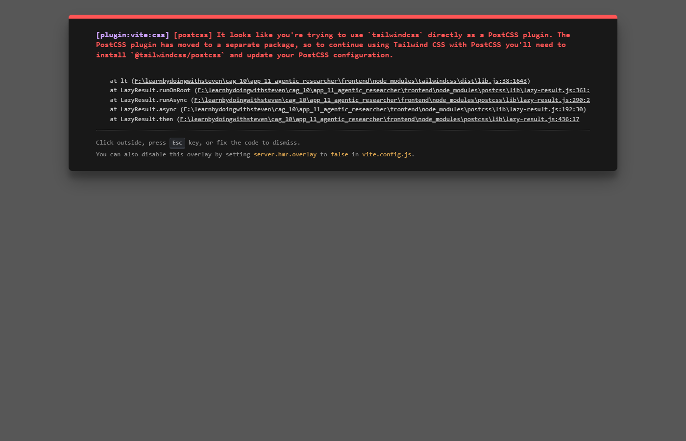

# App 11: Agentic Research Assistant

**State-of-the-Art (SOTA) Context-Augmented Generation**

This application demonstrates advanced CAG patterns using an **Agentic Workflow**.

## SOTA Features
1.  **Planning**: Decomposes complex user queries into actionable research steps.
2.  **Iterative Execution**: Performs retrieval and reasoning for each step.
3.  **Self-Correction**: Uses a reflection step to critique its own answers and refine them before presenting to the user.
4.  **Reasoning Log**: Exposes the internal "thought process" (steps, status, results) to the API for UI visualization.

## Architecture
- **Backend**: FastAPI + `agent_engine.py` (Custom Agent Loop).
- **Engine**: Uses `ollama` (Llama 3 / CodeLlama) for all cognitive tasks.
- **Frontend**: React + Tailwind (Visualization of reasoning steps).

## Status
- **Backend**: Verified Running (Port 8011).
- **Frontend**: Implementation complete (Port 3011), requires environment-specific build.

## API Usage
Post a query to the agent:
```bash
curl -X POST http://localhost:8011/research \
     -H "Content-Type: application/json" \
     -d '{"query": "Explain the history of the internet"}'
```
Response includes `answer`, `steps` (log), and `critique`.
## Test Results ✅

**Query**: _What are the key differences between supervised and unsupervised learning?_

| Metric | Value |
|---|---|
| Status | PASSED |
| Response Length | 1928 chars |
| Context Chunks | 0 |
| Sources Retrieved | `None` |
| Avg Relevance | 0.00 |
| Model | Auto-selected local model |


## Application Screenshot


