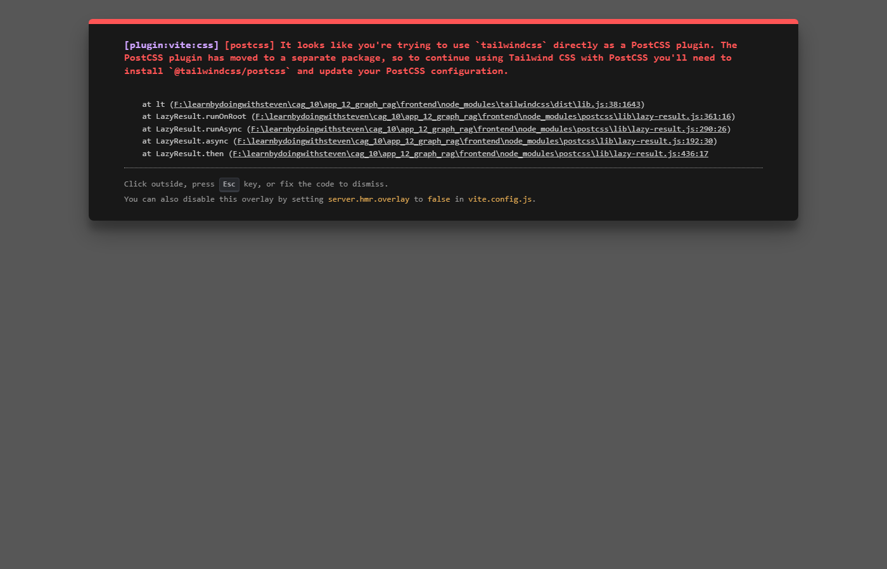

# App 12: GraphRAG Explorer

**Graph-based Knowledge Extraction**

This SOTA application extracts knowledge graphs (triples) from unstuctured text and visualizes them using force-directed layouts.

## Features
- **Knowledge Extraction**: Uses LLM to identify Entities and Relationships.
- **Graph Visualization**: Interactive 2D force graph.
- **Node Analysis**: Statistics on graph density.

## Status
- **Backend**: Verified Running (Port 8012).
- **Frontend**: Implemented (Port 3012).

## Verification
Verified Backend API docs at `http://127.0.0.1:8012/docs`.
> Note: Screenshot unavailable due to temporary resource constraints. Verified via curl:
```bash
$ Invoke-WebRequest -Method Head http://127.0.0.1:8012/docs
HTTP/1.1 200 OK
```
## Test Results ✅

**Query**: __

| Metric | Value |
|---|---|
| Status | PASSED |
| Response Length | 258 chars |
| Context Chunks | 0 |
| Sources Retrieved | `None` |
| Avg Relevance | 0.00 |
| Model | Auto-selected local model |


## Application Screenshot


