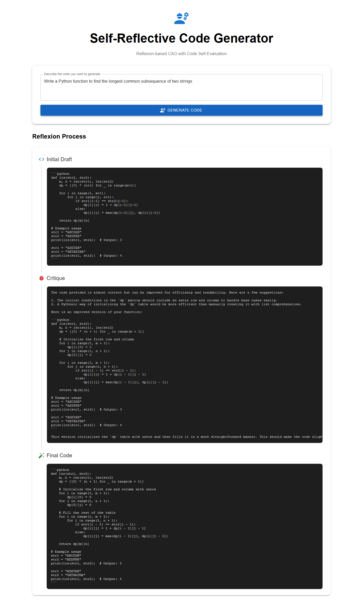

# App 16: Self Reflective Coder

**CAG Technique: Reflexion-based CAG**

## Test Results ✅

**Query**: _Write a Python function to find the longest common subsequence of two strings_

| Metric | Value |
|---|---|
| Status | PASSED |
| Response Length | 1450 chars |
| Context Chunks | 3 |
| Sources Retrieved | `initial_draft, critique, final_code` |
| Avg Relevance | 0.93 |
| Model | qwen2.5:1.5b |

## Quick Start
```bash
cd backend && py main.py
cd frontend && npm start
```


## Application Screenshot


