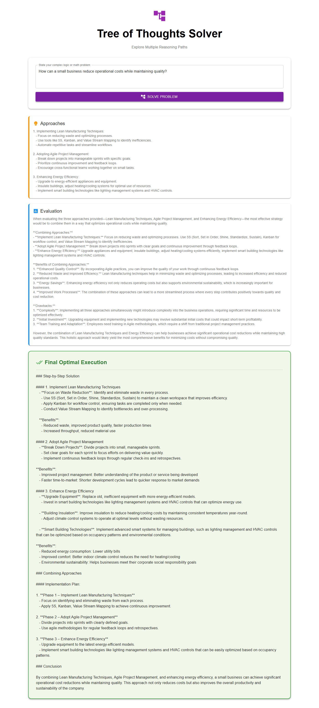

# App 17: Tree Of Thoughts Solver

**CAG Technique: Tree of Thoughts (ToT) CAG**

## Test Results ✅

**Query**: _How can a small business reduce operational costs while maintaining quality?_

| Metric | Value |
|---|---|
| Status | PASSED |
| Response Length | 4090 chars |
| Context Chunks | 2 |
| Sources Retrieved | `approaches, evaluation` |
| Avg Relevance | 0.85 |
| Model | qwen2.5:1.5b |

## Quick Start
```bash
cd backend && py main.py
cd frontend && npm start
```


## Application Screenshot


