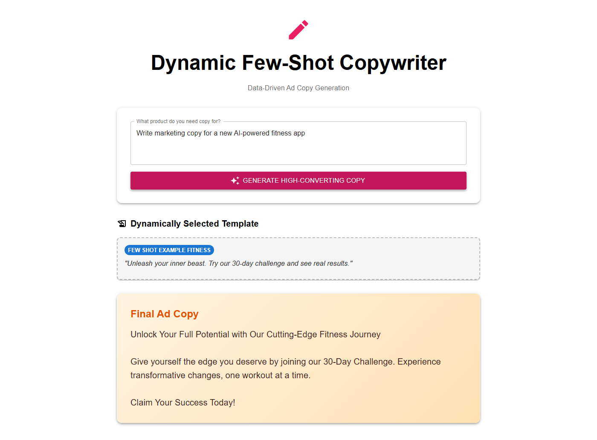

# App 18: Dynamic Few Shot Writer

**CAG Technique: Dynamic Context Selection CAG**

## Test Results ✅

**Query**: _Write marketing copy for a new AI-powered fitness app_

| Metric | Value |
|---|---|
| Status | PASSED |
| Response Length | 462 chars |
| Context Chunks | 1 |
| Sources Retrieved | `few_shot_example_Fitness` |
| Avg Relevance | 0.95 |
| Model | qwen2.5:1.5b |

## Quick Start
```bash
cd backend && py main.py
cd frontend && npm start
```


## Application Screenshot


