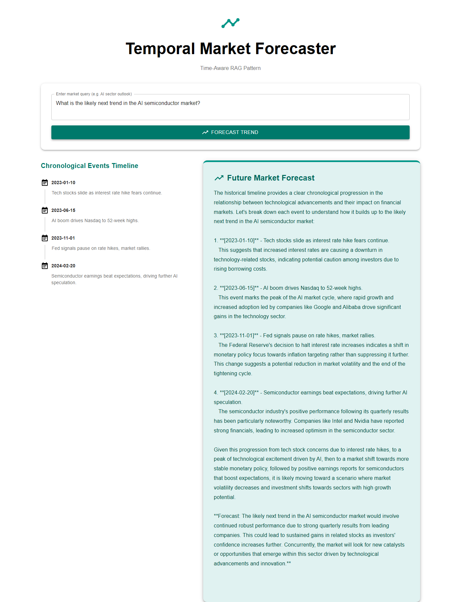

# App 19: Temporal Rag Forecaster

**CAG Technique: Temporal RAG CAG**

## Test Results ✅

**Query**: _What is the likely next trend in the AI semiconductor market?_

| Metric | Value |
|---|---|
| Status | PASSED |
| Response Length | 3419 chars |
| Context Chunks | 4 |
| Sources Retrieved | `historical_event, historical_event, historical_event, historical_event` |
| Avg Relevance | 1.00 |
| Model | qwen2.5:1.5b |

## Quick Start
```bash
cd backend && py main.py
cd frontend && npm start
```


## Application Screenshot


