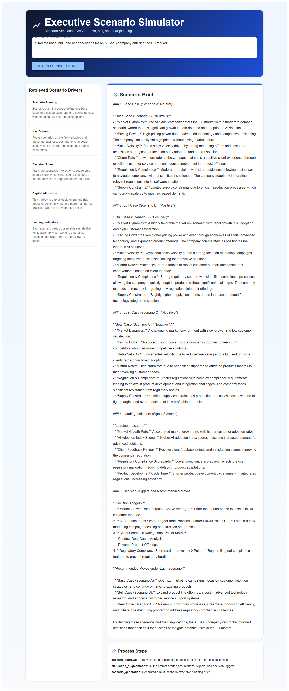

# App 25: Executive Scenario Simulator

**CAG Technique: Scenario Simulation CAG**

## What This App Teaches
How CAG can preload scenario-planning heuristics so the model compares base, bull, and bear cases with explicit indicators and decision triggers.

## Core Workflow
- Retrieve scenario-design patterns for assumptions, indicators, and capital allocation.
- Augment the prompt with structured planning context.
- Generate an executive planning brief with strategic actions under each case.

## Quick Start
```bash
cd backend && py main.py
cd frontend && npm start
```

## Application Screenshot


## Test Results ✅

**Query**: _Simulate base, bull, and bear scenarios for an AI SaaS company entering the EU market_

| Metric | Value |
|---|---|
| Status | PASSED |
| Response Length | 5243 chars |
| Context Chunks | 5 |
| Sources Retrieved | `scenario_frame, drivers, decision_rules, capital_allocation, leading_indicators` |
| Avg Relevance | 0.33 |
| Model | qwen2.5:1.5b |
